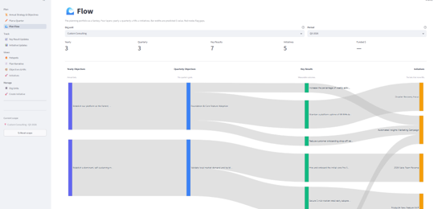
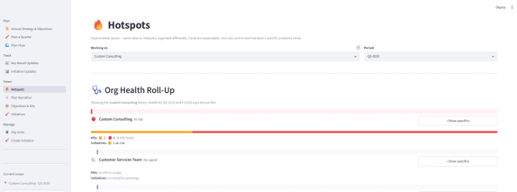
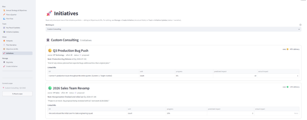
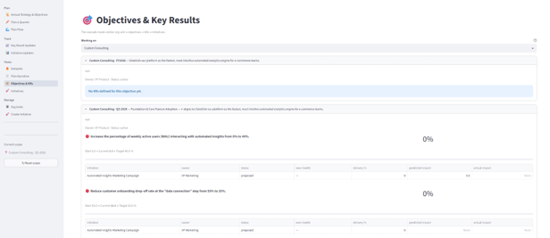

# AI OKR Execution System

A Streamlit + Supabase app for planning, tracking, and reviewing OKRs across a multi-team org. Claude is layered in for KR drafting, exec summaries, check-in review, and — the newer piece — drafting check-ins from ambient signals (simulated Jira, Slack, and calendar activity) so the PM edits a substantive first draft rather than composing from a blank field. Built to be honest about the parts of OKR practice most tools fudge: separating delivery from impact, leading from lagging indicators, exec-facing signal from team-internal status.

> ⚠️ This is a personal portfolio project — it works, but it isn't a hardened product. The repo is public so the modeling decisions are visible to anyone interested in how I think about cross-functional planning systems and how AI can be layered into them without becoming the decision-maker.

---

## Three problems this app addresses

**Connect work to outcomes, and outcomes to strategy.**
Teams do work. Leaders set goals. But too often the connection between them is implicit, verbal, or lost in the gap between project trackers and OKR tools. This app treats the chain — strategy → yearly objective → quarterly objective → KR → initiative — as first-class, visible on every page. An initiative names which KRs it moves and by how much (predicted). Later, retrospective attribution names what actually moved (actual). The through-line stays visible.

**Give leaders a focused view of what matters, not a firehose of data.**
Executive dashboards drown people in numbers when what they need is *judgment about where to look*. Hotspots reads the same underlying data an operational team looks at, and produces an AI-generated summary at the top: three sentences on what needs attention, what's escalating, what's healthy — including cross-functional patterns where one team's work is moving another team's KR. The dashboard is still there below, but you don't have to work through it to know where to focus.

**Help PMs write updates that actually help.**
Having spent years reading status updates from project and product managers, I know the pattern: a busy PM writes a vague "on track" or a generic "some blockers," and a leader has to reply with clarifying questions to get the picture. The app addresses this two ways. If a PM has the context to write the update, the AI review scores it against Clarity, Consistency, Completeness, and Realism — flagging what a leader would ask before the leader has to ask. If the PM would benefit from a starting point, the AI drafts a first version from the initiative's current state, prior narrative, linked KRs, and ambient signals (simulated Jira / Slack / calendar in this demo) — the PM edits from there. Two modes, chosen per update. Both are coaching, not gatekeeping.

---

## Screenshots

### Strategy through execution in one view
Strategies tie to Yearly Objectives, which flow into Quarterly Objectives and Key Results — and Initiatives are the bets driving the KRs.



### Hotspots — what needs attention
A focused triage view for leaders. Each org gets a color-coded health card; expand a card to see that team's specific problems inline.



### Initiatives — portfolio health
Not just delivery status, but how each initiative is actually moving its associated KRs.



### Objectives & KRs — the causal cascade
See how each KR is tracking and which initiatives are contributing to it.



---

## Why this exists

Across most of my program office work, the pattern I saw most consistently was that teams were shipping steadily but nobody could quite say how any of it was contributing to the bottom line. Outputs and progress got conflated; the connection back to what the business actually needed was implicit at best. The tool market mirrors this: most portfolio-management tools emphasize delivery health without a clear view of how the work contributes to outcomes, and most OKR tools track outcomes without traceability back to the specific bets driving them. The two halves of the picture rarely connect cleanly.

In the OKR-tool category specifically, products tend to optimize for one of two things: a polished UI on top of a thin data model (Lattice, Workboard), or a deep configurable system aimed at large enterprises (Quantive, Ally). What I wanted was different — a sketch in code of *what an OKR system that made the connection between work and outcomes explicit would look like*.

Concretely, the design decisions below are the things I'd push back on in most off-the-shelf tools:

### Delivery, impact, and ROI are three different measurements

Most tools have a single "progress" number on an initiative. This app keeps three:

- **Delivery %** — how much of the work has been done
- **Actual KR impact** — how much the linked KR moved as a result (measured retrospectively, on Initiative Updates)
- **Business case ROI** — predicted value vs predicted cost, recorded at planning time

An initiative can ship 100% (delivery done) and move 0% of its target KR (impact missed). That's information worth keeping visible, not collapsing into a single bar.

### Milestone status (team view) and Exec RAG (exec view) are separate fields

Owners set two RAG-style statuses on each initiative:

- **Milestone Delivery Status** — the team's internal view of execution health
- **Exec RAG** — the curated outward signal the owner wants execs to see

When these diverge, that's itself a signal. The Hotspots page surfaces the divergence inline ("exec: 🚧 blocked / team: 🟡 at risk") so you can see when an owner is escalating externally faster than the team's running status reflects.

### KRs get updated directly; initiatives don't update KRs

A KR is a measurement of reality. The world moves it whether or not your initiative shipped. The app models this honestly:

- **KR `current_value`** is edited directly on Key Result Updates (weekly)
- **`actual_kr_impact`** on each initiative→KR link is a retrospective attribution claim (edited on Initiative Updates, lower cadence)

Different question, different cadence, different owner. The "Linked initiatives" reference panel on each KR shows you which bets are aimed at it, but doesn't force the math.

### Leading vs lagging indicators are a tag, not a rollup tree

It's tempting to model leading indicators as parent-child KRs with contribution weights. In practice, the weights become noise — nobody knows whether qualified pipeline drives ARR at 0.4 or 0.6. So this app uses a *declarative tag* on each KR: 🎯 Lagging, 📡 Leading, or standalone. The causal hypothesis is visible without forcing structure that doesn't match reality.

The schema retains `parent_key_result_id` and `contribution_weight` columns as latent infrastructure — if rollup math ever becomes useful, the data layer is ready.

### Initiatives belong to a team, not just to the KRs they move

An initiative's owning team and the KR(s) it moves are independent. A platform team can run an initiative that moves a revenue team's KR — that's the right model for cross-functional work. The `initiative.org_unit_id` field captures ownership separately from the KR linkage.

The Hotspots page has a dedicated **Cross-functional patterns** panel that surfaces these — for example, Platform's Query Engine Caching work moving Product's Activation Rate KR. This is the coordination surface a TPM would want to see on a Monday morning, and it's usually invisible in tools that treat initiatives as owned only by the KRs they contribute to.

### Ambient signals feed the AI, not just what humans typed in

Each initiative in the demo has a **📡 Recent activity** panel showing simulated Jira ticket activity, Slack messages, and calendar events scoped to that initiative. The AI drafting feature reads these when producing a check-in, which is what lets the AI catch things the previous exec narrative missed — a rescheduled architectural review, a near-miss customer incident, PR merges stopping. In production this would be real integrations to Jira, Slack, and calendar; the shape of what the AI consumes is what a production version would look like.

I think about AI-native along a few different axes — how work is authored, what signals AI reads, and what actions the AI takes — rather than as a binary state. The app has moved further on some axes than others, and being deliberate about which axes move next is part of the design.

### AI shows up in more than one shape

Claude (Sonnet and Haiku) is layered into specific, scoped moments in the workflow. Not open-ended chat — targeted assistance at the writing and reviewing surfaces. The app uses Claude for:

- **Suggesting KR drafts** on Plan a Quarter (given an objective's context, propose 2–3 measurable KRs)
- **Summarizing Hotspots** for exec review (a 3–5 sentence brief on top of the org-health cards, including cross-functional patterns)
- **Reviewing check-in updates** on Initiative and Key Result check-in pages (scored against Clarity / Consistency / Completeness / Realism, with a verdict: Ready to send · Needs sharpening · Rework recommended)
- **Drafting check-ins from ambient signals** on Initiative Check-ins (reads Jira / Slack / calendar signals plus the previous narrative and current state, produces a first-draft exec narrative and next-milestone text; the PM edits and saves)

Some of these are the human-drafts / AI-reviews pattern; others are the AI-drafts / human-reviews pattern. Both patterns are valid; the app makes the choice per-update explicit rather than picking one. Milestone status and exec RAG stay human-owned in both patterns — those are situational judgment calls the AI shouldn't anchor.

---

## Pages

Twelve pages in a flat sidebar (the payoff views are first, then the editors, then admin):

- **👋 About this project** — landing page for demo visitors
- **🔥 Hotspots** — operational "what needs my attention?" view. Each org gets a color-coded card with rolled-up health; expand the card to see that team's specific problems (red KRs, blocked initiatives, planning gaps, overdue milestones). An **✨ AI-generated summary** sits at the top with a 3–5 sentence exec brief. A **🔗 Cross-functional patterns** panel below the summary surfaces initiatives whose owning team differs from the KR-owning team
- **📄 Executive Narrative** — read-the-plan-as-prose top to bottom; structured cascade with indented hierarchy
- **🧭 Objectives & KRs** — KR-centric view with linked initiatives as supporting tables (the causal cascade, KR by KR)
- **🚀 Initiatives** — read-only portfolio view of initiatives, grouped by owning team, sorted with problems at top
- **📜 Annual Strategy** — strategies, yearly objectives, aspirational KRs
- **✏️ Plan a Quarter** — the primary planning surface; quarterly objectives, KRs, initiatives, predicted impact, business cases. Each objective has **✨ Suggest KRs with AI**
- **🌊 Planning Flow** — Sankey visualization of the cascade (strategy → yearly → quarterly → KR → initiative) with barycentric ordering to minimize ribbon crossings
- **📈 Key Result Check-ins** — weekly value updates, notes, history per KR. Includes **✨ Ask AI to review this check-in**
- **📊 Initiative Check-ins** — execution updates, milestone status, exec RAG, exec narrative, actual impact. Each initiative shows a **📡 Recent activity** panel with simulated Jira / Slack / calendar signals. Two AI patterns are available on each update: **✨ Draft with AI** (AI drafts from context and signals; PM edits) or **✨ Ask AI to Review** (PM drafts; AI scores against Clarity / Consistency / Completeness / Realism)
- **🏛️ Organization** — team / segment / company hierarchy
- **➕ Create Initiative** — structural editing of initiatives (title, owner, status, effort, linked KRs, business case)

---

## Tech stack

- **Frontend:** Streamlit (Python). Multi-page navigation, custom HTML/CSS where I needed visual punch
- **Database:** Supabase (Postgres), accessed via the service-role key with app-enforced scoping (no Row Level Security — kept the model simple for a single-user portfolio app)
- **Language:** Python 3.11+, with pandas for data manipulation
- **AI:** Anthropic's Claude API. Haiku for structured writing (KR suggestions); Sonnet for evaluation and summarization (Hotspots summary, check-in reviews). Prompts return JSON so the app can render results as structured UI, not free-form chat
- **Visualization:** Plotly for the Planning Flow Sankey; inline SVG for the framework diagram on About

I built this iteratively in multi-hour sessions using Claude Code (Anthropic's CLI agent) for implementation work. The architectural decisions, modeling choices, and feature scoping were mine; the implementation was Claude-assisted. Treat it as a sketch of judgment + delegation, not "wrote it all from scratch."

---

## Local setup

```bash
git clone https://github.com/terrydougan-ai/okr-planning-app
cd okr-planning-app
pip install -r requirements.txt
# Set up a Supabase project, then run schema/schema.sql against it
# (or run schema/migrations.sql in order if you want the historical view)
# Add a .streamlit/secrets.toml with:
#   SUPABASE_URL = "..."
#   SUPABASE_KEY = "..."
streamlit run Overview.py
```

---

## Data model

Eleven tables:

| Table | What it holds |
|---|---|
| `org_unit` | Company / segment / team hierarchy |
| `strategy` | Top-level strategic bets |
| `objective` | Yearly and quarterly objectives, tied to a strategy + org unit |
| `key_result` | KRs under an objective. Tracks start / target / current values, indicator type (lagging/leading), owner |
| `initiative` | Discrete bets the team is making. Tracks owner, status, milestone delivery status, exec RAG, exec narrative, delivery %, owning org unit, plus persisted AI review state |
| `initiative_key_result` | M:N join. Tracks predicted impact and actual impact per (initiative, KR) pair |
| `business_case` | Predicted value, predicted cost, decision, summary — recorded at planning time for each initiative |
| `check_in` | Time series of KR value updates with optional notes |
| `engineering_activity` | Simulated Jira-ish ticket transitions, PR merges, deployments, incidents scoped to an initiative |
| `team_message` | Simulated Slack-ish messages scoped to an initiative, with channel, author, sentiment |
| `calendar_event` | Simulated coordination events (QBRs, incident reviews, decision meetings) scoped to an initiative |

The last three are the ambient signals the AI drafting feature reads. In production they'd be integrations to real Jira, Slack, and calendar APIs; the schema shape is what a production version would need to store.

The schema lives in `/schema/`:
- **`schema.sql`** — current state, the file to run for a fresh-install database
- **`migrations.sql`** — chronological history of every schema change, with notes on why each was added (useful as commentary on the design evolution)

---

## What this is deliberately NOT

- **Not a multi-tenant production tool.** Single-user app with no auth layer; the service-role Supabase key is used directly. Fine for a portfolio app, not fine for real use.
- **Not "feature-complete."** Some pages have backlog items I haven't gotten to (e.g., time-series visualizations on Key Result Check-ins — needs ~6+ weeks of check-in data accumulated first to be worth building; dependency-graph UI — schema is present, UI held).
- **Not a polished product UI.** Streamlit's design vocabulary is what it is. I cared about getting the *model* right, not making it look like Notion.
- **Not opinionated about OKR cadence.** The app supports quarterly and yearly horizons but doesn't force a particular framework. It's a working system, not a methodology.
- **Not integrated with live Jira / Slack / calendar.** The ambient signals are simulated in the database. The shape of what the AI consumes is what a production integration would look like; the integration itself is infrastructure work I didn't want to fake for a portfolio demo.
- **Not a general-purpose AI assistant.** No open-ended chat surface. The AI features are scoped to specific writing, review, and drafting moments — suggest KRs, summarize Hotspots, review a check-in, draft a check-in from signals — with structured outputs the app renders as UI. Each surface has a rubric or output schema the model works against, not a blank prompt.

---

## What I'd build next

In rough order of value:

1. **Real Jira / Slack / calendar integrations to replace the simulated signals.** The AI drafting feature is currently reading seeded data. Wiring it to actual sources of engineering activity and team communication is the biggest lever on making the drafts genuinely useful in a real org.
2. **Blockers as a first-class entity.** The schema is set up for it; the UI is deferred. Blockers with an AI review pass ("is this described specifically enough that someone reading could act on it?") is the natural next step once the drafting feature has run against real data.
3. **Trends / time-series page.** The `check_in` table is accumulating data; a per-KR line chart over the last 8 weeks would close the "is this getting better or worse?" gap a single color dot can't answer.
4. **Quarterly review export.** PDF or Markdown of the closing state of a quarter — KRs with final values, initiatives with actual impact recorded — useful as an exec deliverable.
5. **Predicted vs actual retrospective view.** For each KR with linked initiatives, side-by-side comparison of predicted impact (planning) vs measured impact (execution). Calibrates the team's planning over time.

Some of these aren't done because they need real production data to be meaningful — building them now would give me flat lines and empty comparisons. Others (integrations, blockers) are the natural next builds on the AI-native side of the app.
